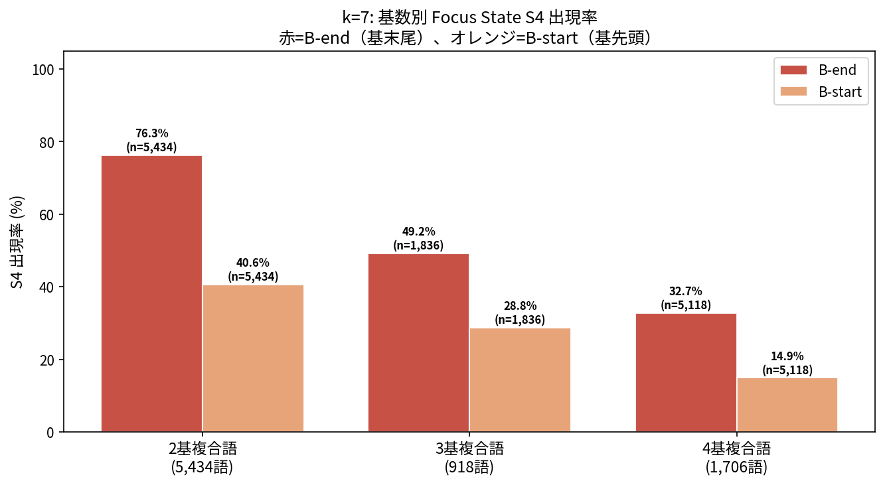
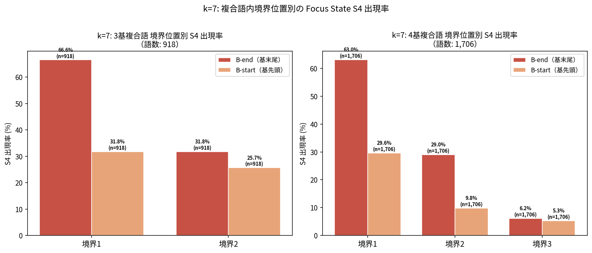
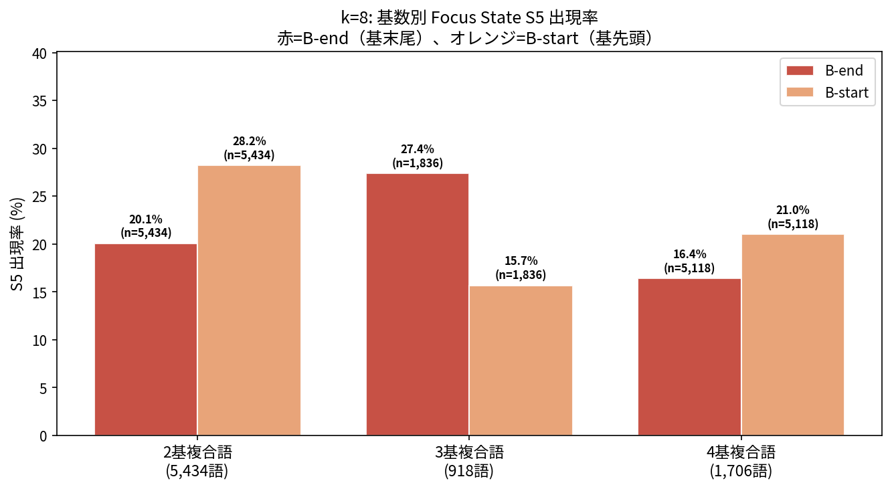
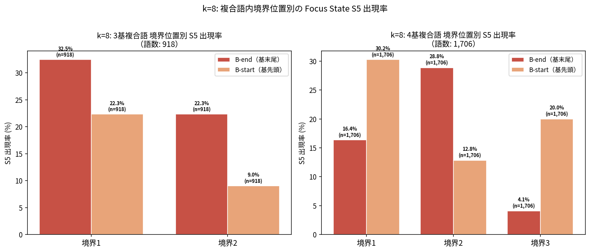

# 基数別パターン分析: 2基 vs 3基 vs 4基複合語

**生成日時**: 2026-03-04 08:27:43
**スクリプト**: `hypothesis/02_compound_hmm/source/base_count_analysis.py`

---

## 検証目的

`interpretation_notes.md` Section 7.4 に対応:

> 基数別の分析: 2基複合語 vs 3基複合語で境界集中パターンが変わるか

複合語構造が真に存在する場合、境界での Focus State 集中は基数によらず安定するはず。
逆に偶然や文字制約の産物であれば、基数による系統的変化が予想される。

また3基・4基複合語では「内部境界 vs 外部境界」の比較により、
語全体の端に近い境界と中間の境界でパターンが異なるかも確認する。

---

## k=7  (Phantom: S3, Focus: S4)

### 語数・境界数

| 基数 | 語数 | 境界数/語 | 総境界数 |
|------|------|---------|---------|
| 2基 | 5,434 | 1 | 5,434 |
| 3基 | 918 | 2 | 1,836 |
| 4基 | 1,706 | 3 | 5,118 |

### S4 出現率（基数別 × 位置別）

| 基数 | B-end 率 | B-end n | B-start 率 | B-start n | B-end > B-start? |
|------|---------|--------|-----------|----------|----------------|
| 2基 | 76.3% | 5,434 | 40.6% | 5,434 | ✓ |
| 3基 | 49.2% | 1,836 | 28.8% | 1,836 | ✓ |
| 4基 | 32.7% | 5,118 | 14.9% | 5,118 | ✓ |

### Fisher 検定: 基数間の B-end 出現率比較

| 比較 | 率A | 率B | p値 | オッズ比 | 判定 |
|------|-----|-----|-----|---------|------|
| 2基 vs 3基 (B-end) | 76.3% | 49.2% | 3.51e-100 | 3.323 if not np.isnan(odds) else 'N/A'| **有意差あり** |
| 2基 vs 4基 (B-end) | 76.3% | 32.7% | 0.00e+00 | 6.616 if not np.isnan(odds) else 'N/A'| **有意差あり** |
| 3基 vs 4基 (B-end) | 49.2% | 32.7% | 2.86e-35 | 1.991 if not np.isnan(odds) else 'N/A'| **有意差あり** |

### 3基複合語: 境界インデックス別 S4 出現率

| 境界 | B-end 率 | B-end n | B-start 率 | B-start n |
|------|---------|--------|-----------|----------|
| 境界1 (base1/base2間) | 66.6% | 918 | 31.8% | 918 |
| 境界2 (base2/base3間) | 31.8% | 918 | 25.7% | 918 |

### 4基複合語: 境界インデックス別 S4 出現率

| 境界 | B-end 率 | B-end n | B-start 率 | B-start n |
|------|---------|--------|-----------|----------|
| 境界1 (base1/base2間) | 63.0% | 1,706 | 29.6% | 1,706 |
| 境界2 (base2/base3間) | 29.0% | 1,706 | 9.8% | 1,706 |
| 境界3 (base3/base4間) | 6.2% | 1,706 | 5.3% | 1,706 |

---

## k=8  (Phantom: S4, Focus: S5)

### 語数・境界数

| 基数 | 語数 | 境界数/語 | 総境界数 |
|------|------|---------|---------|
| 2基 | 5,434 | 1 | 5,434 |
| 3基 | 918 | 2 | 1,836 |
| 4基 | 1,706 | 3 | 5,118 |

### S5 出現率（基数別 × 位置別）

| 基数 | B-end 率 | B-end n | B-start 率 | B-start n | B-end > B-start? |
|------|---------|--------|-----------|----------|----------------|
| 2基 | 20.1% | 5,434 | 28.2% | 5,434 | ✗ |
| 3基 | 27.4% | 1,836 | 15.7% | 1,836 | ✓ |
| 4基 | 16.4% | 5,118 | 21.0% | 5,118 | ✗ |

### Fisher 検定: 基数間の B-end 出現率比較

| 比較 | 率A | 率B | p値 | オッズ比 | 判定 |
|------|-----|-----|-----|---------|------|
| 2基 vs 3基 (B-end) | 20.1% | 27.4% | 1.21e-10 | 0.666 if not np.isnan(odds) else 'N/A'| **有意差あり** |
| 2基 vs 4基 (B-end) | 20.1% | 16.4% | 1.32e-06 | 1.278 if not np.isnan(odds) else 'N/A'| **有意差あり** |
| 3基 vs 4基 (B-end) | 27.4% | 16.4% | 3.72e-23 | 1.919 if not np.isnan(odds) else 'N/A'| **有意差あり** |

### 3基複合語: 境界インデックス別 S5 出現率

| 境界 | B-end 率 | B-end n | B-start 率 | B-start n |
|------|---------|--------|-----------|----------|
| 境界1 (base1/base2間) | 32.5% | 918 | 22.3% | 918 |
| 境界2 (base2/base3間) | 22.3% | 918 | 9.0% | 918 |

### 4基複合語: 境界インデックス別 S5 出現率

| 境界 | B-end 率 | B-end n | B-start 率 | B-start n |
|------|---------|--------|-----------|----------|
| 境界1 (base1/base2間) | 16.4% | 1,706 | 30.2% | 1,706 |
| 境界2 (base2/base3間) | 28.8% | 1,706 | 12.8% | 1,706 |
| 境界3 (base3/base4間) | 4.1% | 1,706 | 20.0% | 1,706 |

---

## 総括

| 問い | 期待 (複合語構造が実在) | 期待 (文字制約の偶然) |
|------|--------------------|--------------------|
| 基数間で B-end 率が安定するか | 安定（構造は基数によらない） | 変動あり |
| B-end > B-start が全基数で成立するか | 全基数で成立 | 特定基数のみ |
| 3基: 第1境界 ≈ 第2境界か | 両境界で同程度集中 | 非対称になる可能性 |

_本レポートは `base_count_analysis.py` により自動生成。_