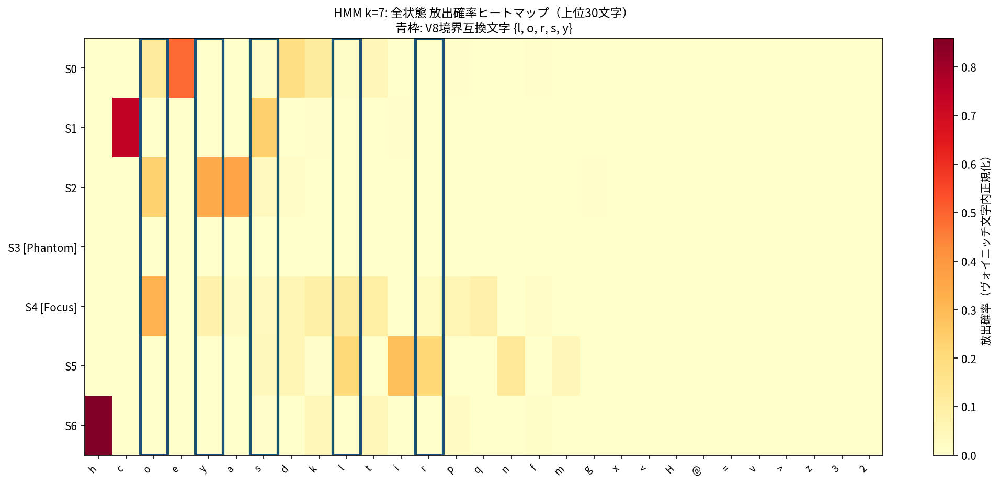
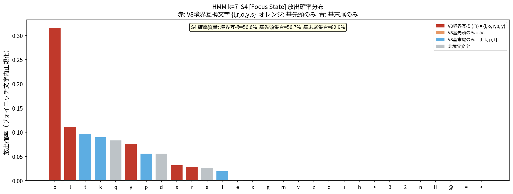
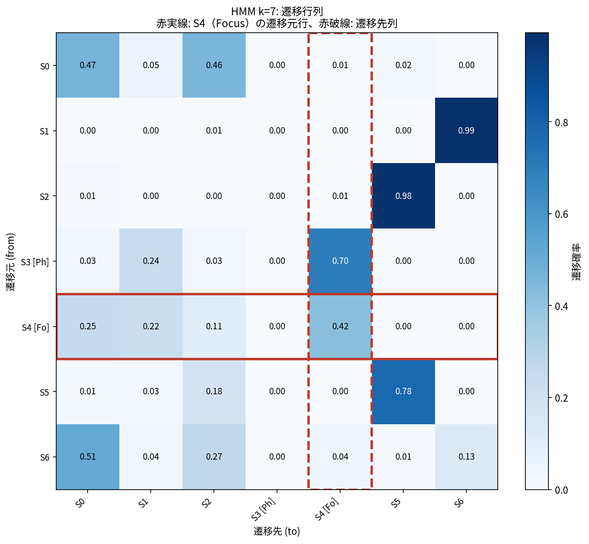
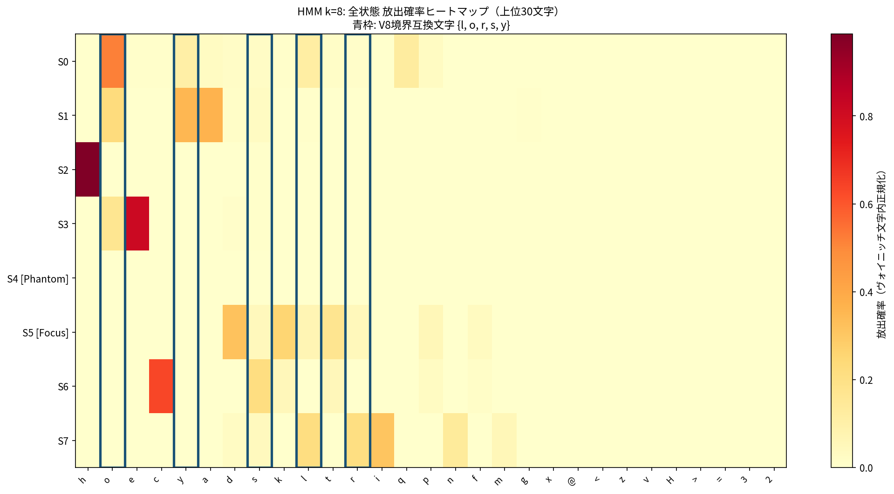
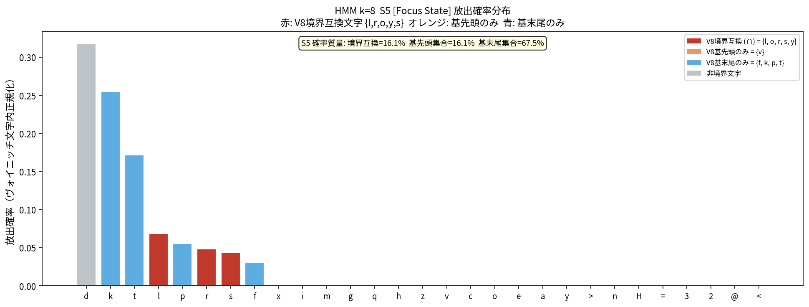
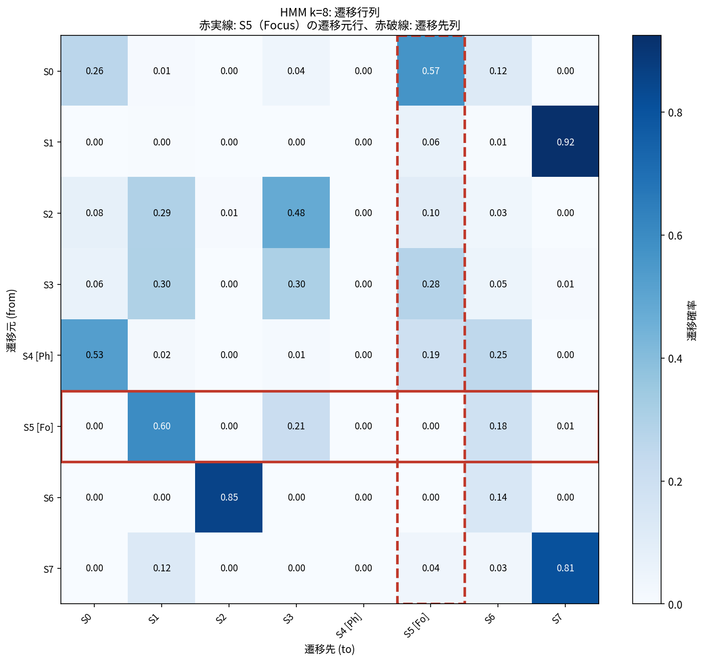

# Emission Probability 直接確認レポート

**生成日時**: 2026-03-04 08:07:20
**スクリプト**: `hypothesis/02_compound_hmm/source/emission_analysis.py`
**HMMモデル**: `hypothesis/01_bigram/results/hmm_model_cache/full_k7.npz`, `full_k8.npz`

---

## 検証目的

`interpretation_notes.md` Section 7 の未解決問い:

1. **S4 放出分布**: S4 (k=7) の emission probability 上位文字が V8 境界互換文字 `{l, r, o, y, s}` と一致するか
2. **S4 遷移行列**: S4 → S? の遷移確率（S4→S4 自己遷移が低いか）
3. **k=8 全状態の放出分布**: S0 の役割の再検討

### V8 文字集合の定義

| 集合 | 文字 | 根拠 |
|------|------|------|
| 基先頭 (SLOTS_V8[0]) | `{l, o, r, s, v, y}` | 各基の先頭文字 |
| 基末尾 (SLOTS_V8[13-15]) | `{f, k, l, o, p, r, s, t, y}` | 各基の末尾文字 |
| **境界互換 (∩)** | **`{l, o, r, s, y}`** | 先頭 ∩ 末尾 |

---

## k=7  (Phantom: S3, Focus: S4)

**logL**: -126899.75

### 全状態の V8 境界文字への確率質量

| 状態 | 境界互換 (∩) | 基先頭集合 | 基末尾集合 | 注記 |
|------|-------------|-----------|-----------|------|
| S0 | 15.2% | 15.2% | 33.3% |  |
| S1 | 24.3% | 24.3% | 25.4% |  |
| S2 | 61.2% | 61.2% | 61.4% |  |
| S3 | 17.2% | 20.7% | 31.0% | **[Phantom]** |
| S4 | 56.6% | 56.7% | 82.9% | **[Focus]** ← 境界集中状態 |
| S5 | 46.3% | 46.3% | 47.7% |  |
| S6 | 0.9% | 0.9% | 14.0% |  |

### S4 [Focus State] 上位10文字

| 順位 | 文字 | 放出確率 | V8境界文字? |
|------|------|---------|------------|
| 1 | `o` | 0.3166 | ✓ 境界互換 (∩) |
| 2 | `l` | 0.1115 | ✓ 境界互換 (∩) |
| 3 | `t` | 0.0962 | △ 基末尾のみ |
| 4 | `k` | 0.0905 | △ 基末尾のみ |
| 5 | `q` | 0.0835 | — |
| 6 | `y` | 0.0767 | ✓ 境界互換 (∩) |
| 7 | `p` | 0.0566 | △ 基末尾のみ |
| 8 | `d` | 0.0564 | — |
| 9 | `s` | 0.0325 | ✓ 境界互換 (∩) |
| 10 | `r` | 0.0290 | ✓ 境界互換 (∩) |

### S4 確率質量サマリー

- **V8 境界互換文字 {l,r,o,y,s} への確率質量**: 56.6%
- **V8 基先頭集合 全体 への確率質量**: 56.7%
- **V8 基末尾集合 全体 への確率質量**: 82.9%

### S4 → ? 遷移確率（行方向）

| 遷移先 | 確率 | 注記 |
|--------|------|------|
| S0 | 0.2465 |  |
| S1 | 0.2246 |  |
| S2 | 0.1077 |  |
| S3 | 0.0000 | [Phantom] |
| S4 | 0.4212 | **自己遷移** |
| S5 | 0.0000 |  |
| S6 | 0.0000 |  |

> S4 自己遷移確率: **0.4212**
> （自己遷移が低いほど、B-end の直後 B-start で S4 が抑制されるメカニズムが強く働く）

### 全状態の上位5文字（全体像）

| 状態 | 1位 | 2位 | 3位 | 4位 | 5位 | 注記 |
|------|-----|-----|-----|-----|-----|------|
| S0 | e(0.485) | d(0.180) | **o**(0.118) | k(0.112) | t(0.052) |  |
| S1 | c(0.741) | **s**(0.240) | k(0.006) | i(0.005) | **o**(0.003) |  |
| S2 | a(0.358) | **y**(0.343) | **o**(0.232) | **s**(0.033) | d(0.017) |  |
| S3 | z(0.034) | h(0.034) | 3(0.034) | <(0.034) | =(0.034) | [Phantom] |
| S4 | **o**(0.317) | **l**(0.111) | t(0.096) | k(0.091) | q(0.083) | [Focus] |
| S5 | i(0.285) | **r**(0.215) | **l**(0.210) | n(0.126) | d(0.057) |  |
| S6 | h(0.859) | t(0.050) | k(0.048) | p(0.022) | f(0.011) |  |

---

## k=8  (Phantom: S4, Focus: S5)

**logL**: -122904.66

### 全状態の V8 境界文字への確率質量

| 状態 | 境界互換 (∩) | 基先頭集合 | 基末尾集合 | 注記 |
|------|-------------|-----------|-----------|------|
| S0 | 76.6% | 76.6% | 81.6% |  |
| S1 | 61.3% | 61.3% | 61.3% |  |
| S2 | 1.0% | 1.0% | 1.3% |  |
| S3 | 17.3% | 17.3% | 17.3% |  |
| S4 | 17.2% | 20.7% | 31.0% | **[Phantom]** |
| S5 | 16.1% | 16.1% | 67.5% | **[Focus]** ← 境界集中状態 |
| S6 | 21.6% | 21.6% | 36.4% |  |
| S7 | 46.8% | 46.8% | 46.8% |  |

### S5 [Focus State] 上位10文字

| 順位 | 文字 | 放出確率 | V8境界文字? |
|------|------|---------|------------|
| 1 | `d` | 0.3183 | — |
| 2 | `k` | 0.2554 | △ 基末尾のみ |
| 3 | `t` | 0.1720 | △ 基末尾のみ |
| 4 | `l` | 0.0688 | ✓ 境界互換 (∩) |
| 5 | `p` | 0.0554 | △ 基末尾のみ |
| 6 | `r` | 0.0484 | ✓ 境界互換 (∩) |
| 7 | `s` | 0.0440 | ✓ 境界互換 (∩) |
| 8 | `f` | 0.0309 | △ 基末尾のみ |
| 9 | `x` | 0.0021 | — |
| 10 | `i` | 0.0012 | — |

### S5 確率質量サマリー

- **V8 境界互換文字 {l,r,o,y,s} への確率質量**: 16.1%
- **V8 基先頭集合 全体 への確率質量**: 16.1%
- **V8 基末尾集合 全体 への確率質量**: 67.5%

### S5 → ? 遷移確率（行方向）

| 遷移先 | 確率 | 注記 |
|--------|------|------|
| S0 | 0.0000 |  |
| S1 | 0.5976 |  |
| S2 | 0.0000 |  |
| S3 | 0.2124 |  |
| S4 | 0.0000 | [Phantom] |
| S5 | 0.0000 | **自己遷移** |
| S6 | 0.1848 |  |
| S7 | 0.0052 |  |

> S5 自己遷移確率: **0.0000**
> （自己遷移が低いほど、B-end の直後 B-start で S5 が抑制されるメカニズムが強く働く）

### 全状態の上位5文字（全体像）

| 状態 | 1位 | 2位 | 3位 | 4位 | 5位 | 注記 |
|------|-----|-----|-----|-----|-----|------|
| S0 | **o**(0.518) | q(0.125) | **l**(0.113) | **y**(0.105) | a(0.030) |  |
| S1 | a(0.366) | **y**(0.353) | **o**(0.225) | **s**(0.028) | d(0.012) |  |
| S2 | h(0.986) | **s**(0.008) | **o**(0.002) | k(0.002) | t(0.001) |  |
| S3 | e(0.814) | **o**(0.166) | d(0.011) | **s**(0.007) | c(0.002) |  |
| S4 | z(0.034) | h(0.034) | 3(0.034) | <(0.034) | =(0.034) | [Phantom] |
| S5 | d(0.318) | k(0.255) | t(0.172) | **l**(0.069) | p(0.055) | [Focus] |
| S6 | c(0.635) | **s**(0.214) | t(0.053) | k(0.052) | p(0.029) |  |
| S7 | i(0.309) | **l**(0.214) | **r**(0.212) | n(0.137) | m(0.056) |  |

---

## 総括: 交絡 vs 構造効果の最終評価

本分析は emission probability の直接観察により、以下を検証する:

| 検証項目 | 判定基準 |
|---------|---------|
| S4 が境界互換文字 {l,r,o,y,s} に特化しているか | 確率質量 > 50% → 文字種クラスタリングが主因 |
| S4 の自己遷移が低いか | < 0.3 → B-end後B-startでの抑制メカニズムが成立 |
| 全状態で V8 境界文字集合への質量が S4 で最大か | S4 が突出 → 境界特化状態 |

_このレポートは `emission_analysis.py` により自動生成。_