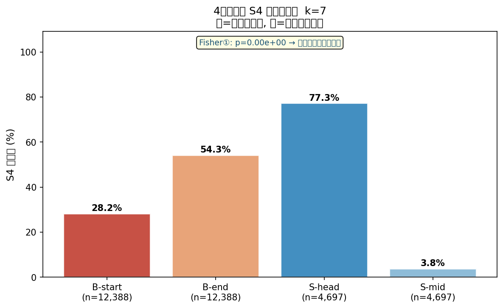
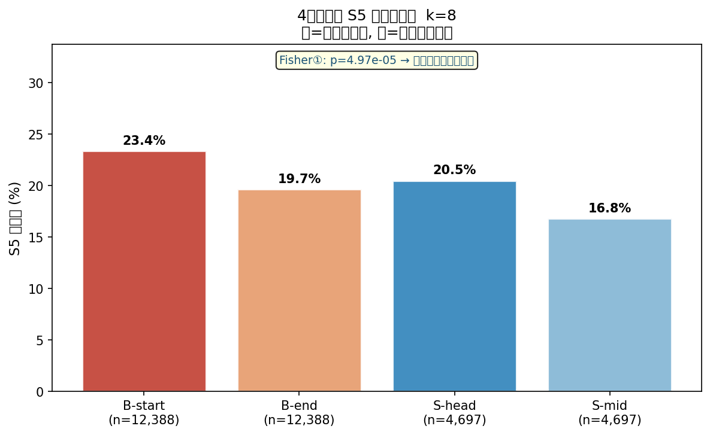

# Section 6.2 検証: 非複合語（単独ベース語）との比較

生成日時: 2026-03-03 23:25:03

## 検証概要

**交絡仮説**: V8文法は複合語の第2基以降の先頭文字を {o,q,l,r,y} などに制約する。
HMMがこれらを独立にクラスタリングした結果として境界集中が生じているだけかもしれない。

**検証設計**: 4グループ比較

| グループ | 定義 | 語種 |
|---------|------|------|
| B-start | 複合語の第2基以降の先頭文字（境界先頭） | 複合語 |
| B-end   | 複合語の第n基の末尾文字（境界末尾）   | 複合語 |
| S-head  | 単独ベース語の pos=0（語頭）          | 単独ベース語 |
| S-mid   | 単独ベース語の pos=L//2（語中央）     | 単独ベース語 |

**判定基準 (Fisher①: B-start vs S-head)**:
- `rate(B-start) ≈ rate(S-head)` (p > 0.05) → **交絡確認** — 文字種制約で説明可能
- `rate(B-start) >> rate(S-head)` (p < 0.05) → **構造効果あり** — 複合構造が独立に影響

**対象語数**: V8複合語 8,058 語 / 単独ベース語 4,697 語

## k=7  (Phantom State: S3 / Focus State: S4)

### S4 出現率（4グループ）

| グループ | S4 出現率 | 件数 | 合計 |
|---------|--------------|------|------|
| B-start | 28.25% | 3,499 | 12,388 |
| B-end | 54.26% | 6,722 | 12,388 |
| S-head | 77.26% | 3,629 | 4,697 |
| S-mid | 3.81% | 179 | 4,697 |

### Fisher 正確検定（S4 出現率の差）

| 比較 | グループA | グループB | 率A | 率B | p値 | オッズ比 | 判定 |
|-----|-----------|-----------|-----|-----|-----|---------|------|
| ①confound検定 (B-start vs S-head) | 28.25% (n=12,388) | 77.26% (n=4,697) | 28.25% | 77.26% | 0.00e+00 | 0.116 | **有意差あり** |
| ②構造効果 (B-start vs S-mid) | 28.25% (n=12,388) | 3.81% (n=4,697) | 28.25% | 3.81% | 0.00e+00 | 9.935 | **有意差あり** |
| ③境界末尾 vs 境界先頭 | 54.26% (n=12,388) | 28.25% (n=12,388) | 54.26% | 28.25% | 0.00e+00 | 3.014 | **有意差あり** |
| ④境界末尾 vs 語中央 | 54.26% (n=12,388) | 3.81% (n=4,697) | 54.26% | 3.81% | 0.00e+00 | 29.944 | **有意差あり** |

### 4グループ間 カイ二乗検定（S4）

χ² = 6969.58,  dof = 3,  p = 0.000e+00

### 解釈 (k=7)

**【交絡否定・語頭状態仮説】** B-start (28.25%) << S-head (77.26%)
(Fisher①: p = 0.0000e+00, odds = 0.116)

交絡仮説は「B-start ≈ S-head（どちらも基先頭文字）」を予測するが、
実際には B-start が S-head を大幅に下回る。
この **逆転** は単純な文字種クラスタリング仮説を否定する。

S4 は「語全体の先頭（S-head: 77.3%）」に特化した
**語頭状態** として機能していると解釈できる。
複合語の内部基先頭（B-start: 28.2%）では、語の途中にあるため語頭状態が抑制される。

注目: B-end (54.26%) が B-start (28.25%) を上回る点も重要。
S4 は複合語内で「基の末尾（次の基への遷移点）」にも集中しており、
これは複合構造を反映した状態配分だが、
その機能は「文字種クラスタリング」ではなく「基末尾遷移点への特化」を示す。

**B-end (境界末尾) の S4 率: 54.26%**
（B-end > B-start の場合: S4 は基末尾の遷移点に集中 → 基終端ハブ状態の可能性）
（B-end < B-start の場合: 境界位置全体の傾向は先頭側に偏る → 文字種仮説寄り）

## k=8  (Phantom State: S4 / Focus State: S5)

### S5 出現率（4グループ）

| グループ | S5 出現率 | 件数 | 合計 |
|---------|--------------|------|------|
| B-start | 23.40% | 2,899 | 12,388 |
| B-end | 19.66% | 2,435 | 12,388 |
| S-head | 20.50% | 963 | 4,697 |
| S-mid | 16.80% | 789 | 4,697 |

### Fisher 正確検定（S5 出現率の差）

| 比較 | グループA | グループB | 率A | 率B | p値 | オッズ比 | 判定 |
|-----|-----------|-----------|-----|-----|-----|---------|------|
| ①confound検定 (B-start vs S-head) | 23.40% (n=12,388) | 20.50% (n=4,697) | 23.40% | 20.50% | 4.97e-05 | 1.185 | **有意差あり** |
| ②構造効果 (B-start vs S-mid) | 23.40% (n=12,388) | 16.80% (n=4,697) | 23.40% | 16.80% | 1.51e-21 | 1.513 | **有意差あり** |
| ③境界末尾 vs 境界先頭 | 19.66% (n=12,388) | 23.40% (n=12,388) | 19.66% | 23.40% | 8.07e-13 | 0.801 | **有意差あり** |
| ④境界末尾 vs 語中央 | 19.66% (n=12,388) | 16.80% (n=4,697) | 19.66% | 16.80% | 1.76e-05 | 1.212 | **有意差あり** |

### 4グループ間 カイ二乗検定（S5）

χ² = 106.81,  dof = 3,  p = 5.319e-23

### 解釈 (k=8)

**【構造効果あり】** B-start (23.40%) >> S-head (20.50%)
(Fisher①: p = 4.9725e-05)

S5 の境界集中は文字種制約だけでは説明できず、
複合語構造そのものが HMM 状態遷移に影響している可能性がある。
V8 文法（独立）と HMM（独立）が同じ複合構造を発見したことを示唆する。

**B-end (境界末尾) の S5 率: 19.66%**
（B-end > B-start の場合: S5 は基末尾の遷移点に集中 → 基終端ハブ状態の可能性）
（B-end < B-start の場合: 境界位置全体の傾向は先頭側に偏る → 文字種仮説寄り）

## 総括

本検証は `compound_boundary_analysis.py` が報告した
「HMM 状態が V8 複合語境界に有意集中する」結果の交絡因子を検証した。

| k | 判定 | B-start 率 | S-head 率 | Fisher① p |
|---|------|-----------|----------|----------|
| 7 | **交絡否定（逆転）** | 28.25% | 77.26% | 0.000e+00 |
| 8 | **構造効果あり** | 23.40% | 20.50% | 4.972e-05 |

---
_本レポートは `single_vs_compound_analysis.py` により自動生成。_