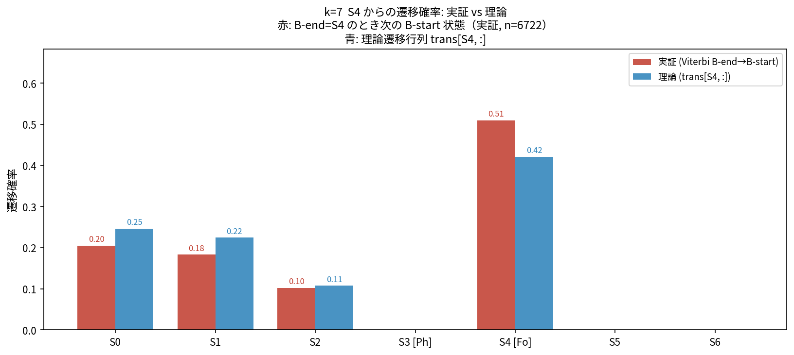
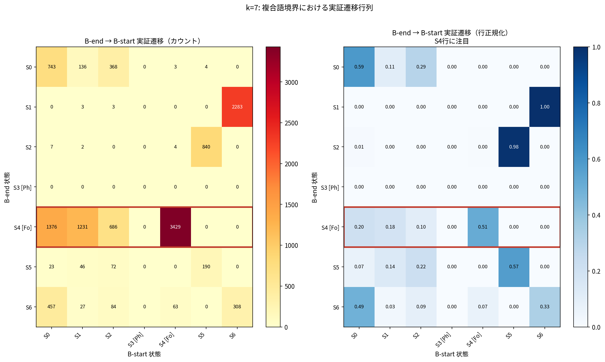
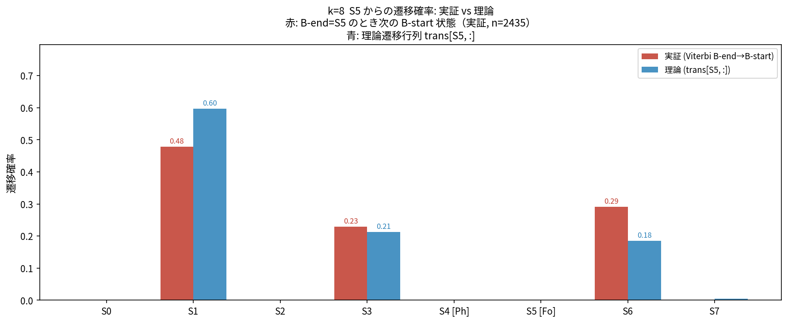
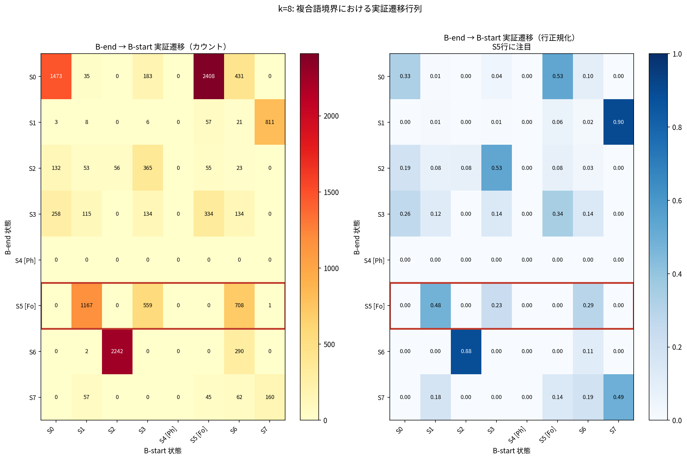

# S4 → ? 実証遷移分析: B-end 直後の状態分布

**生成日時**: 2026-03-04 08:27:12
**スクリプト**: `hypothesis/02_compound_hmm/source/transition_after_bend_analysis.py`

---

## 検証目的

`interpretation_notes.md` Section 5.3 のメカニズム検証:

> S4 は S4 の直後には来にくい（自己遷移が低い）ため、
> B-end で S4 が出た後の B-start では S4 が抑制される。

理論値（遷移行列）と実証値（Viterbi パス上での B-end→B-start 実測遷移）を直接比較する。

---

## k=7  (Phantom: S3, Focus: S4)

**集計対象**: 全複合語の全境界ペア（B-end, B-start）合計 **12,388** ペア

### S4 を B-end 状態としたときの B-start 状態分布

（「B-end = S4」の条件付き B-start 状態分布, n=6,722）

| B-start 状態 | 実証確率 | 実証カウント | 理論確率 (trans) | 差分 | 注記 |
|-------------|---------|------------|----------------|------|------|
| S0 | 0.205 (20.5%) | 1,376 | 0.246 (24.6%) | -0.042 |  |
| S1 | 0.183 (18.3%) | 1,231 | 0.225 (22.5%) | -0.041 |  |
| S2 | 0.102 (10.2%) | 686 | 0.108 (10.8%) | -0.006 |  |
| S3 | 0.000 (0.0%) | 0 | 0.000 (0.0%) | +0.000 | [Phantom] |
| S4 | 0.510 (51.0%) | 3,429 | 0.421 (42.1%) | +0.089 | **自己遷移** |
| S5 | 0.000 (0.0%) | 0 | 0.000 (0.0%) | -0.000 |  |
| S6 | 0.000 (0.0%) | 0 | 0.000 (0.0%) | -0.000 |  |

> **S4 自己遷移**: 実証 = 0.510 (51.0%) / 理論 = 0.421 (42.1%)

### B-end → B-start 実証遷移行列（全状態、行正規化）

行: B-end 状態 / 列: B-start 状態 / 値: 実証確率（行合計=1）

| B-end \ B-start | S0 | S1 | S2 | S3 | S4 | S5 | S6 |
|---|---|---|---|---|---|---|---|
| S0 | **0.59** | 0.11 | 0.29 | 0.00 | 0.00 | 0.00 | 0.00 |
| S1 | 0.00 | **0.00** | 0.00 | 0.00 | 0.00 | 0.00 | 1.00 |
| S2 | 0.01 | 0.00 | **0.00** | 0.00 | 0.00 | 0.98 | 0.00 |
| S3 [Phantom] | 0.00 | 0.00 | 0.00 | **0.00** | 0.00 | 0.00 | 0.00 |
| S4 **[Focus]** | 0.20 | 0.18 | 0.10 | 0.00 | **0.51** | 0.00 | 0.00 |
| S5 | 0.07 | 0.14 | 0.22 | 0.00 | 0.00 | **0.57** | 0.00 |
| S6 | 0.49 | 0.03 | 0.09 | 0.00 | 0.07 | 0.00 | **0.33** |

（カウント合計: 12,388）

---

## k=8  (Phantom: S4, Focus: S5)

**集計対象**: 全複合語の全境界ペア（B-end, B-start）合計 **12,388** ペア

### S5 を B-end 状態としたときの B-start 状態分布

（「B-end = S5」の条件付き B-start 状態分布, n=2,435）

| B-start 状態 | 実証確率 | 実証カウント | 理論確率 (trans) | 差分 | 注記 |
|-------------|---------|------------|----------------|------|------|
| S0 | 0.000 (0.0%) | 0 | 0.000 (0.0%) | -0.000 |  |
| S1 | 0.479 (47.9%) | 1,167 | 0.598 (59.8%) | -0.118 |  |
| S2 | 0.000 (0.0%) | 0 | 0.000 (0.0%) | +0.000 |  |
| S3 | 0.230 (23.0%) | 559 | 0.212 (21.2%) | +0.017 |  |
| S4 | 0.000 (0.0%) | 0 | 0.000 (0.0%) | +0.000 | [Phantom] |
| S5 | 0.000 (0.0%) | 0 | 0.000 (0.0%) | -0.000 | **自己遷移** |
| S6 | 0.291 (29.1%) | 708 | 0.185 (18.5%) | +0.106 |  |
| S7 | 0.000 (0.0%) | 1 | 0.005 (0.5%) | -0.005 |  |

> **S5 自己遷移**: 実証 = 0.000 (0.0%) / 理論 = 0.000 (0.0%)

### B-end → B-start 実証遷移行列（全状態、行正規化）

行: B-end 状態 / 列: B-start 状態 / 値: 実証確率（行合計=1）

| B-end \ B-start | S0 | S1 | S2 | S3 | S4 | S5 | S6 | S7 |
|---|---|---|---|---|---|---|---|---|
| S0 | **0.33** | 0.01 | 0.00 | 0.04 | 0.00 | 0.53 | 0.10 | 0.00 |
| S1 | 0.00 | **0.01** | 0.00 | 0.01 | 0.00 | 0.06 | 0.02 | 0.90 |
| S2 | 0.19 | 0.08 | **0.08** | 0.53 | 0.00 | 0.08 | 0.03 | 0.00 |
| S3 | 0.26 | 0.12 | 0.00 | **0.14** | 0.00 | 0.34 | 0.14 | 0.00 |
| S4 [Phantom] | 0.00 | 0.00 | 0.00 | 0.00 | **0.00** | 0.00 | 0.00 | 0.00 |
| S5 **[Focus]** | 0.00 | 0.48 | 0.00 | 0.23 | 0.00 | **0.00** | 0.29 | 0.00 |
| S6 | 0.00 | 0.00 | 0.88 | 0.00 | 0.00 | 0.00 | **0.11** | 0.00 |
| S7 | 0.00 | 0.18 | 0.00 | 0.00 | 0.00 | 0.14 | 0.19 | **0.49** |

（カウント合計: 12,388）

---

## 総括

本分析は理論遷移行列（Baum-Welch 学習結果）と
実際の Viterbi パス上での B-end → B-start 実証遷移を直接比較した。

| k | Focus | 実証自己遷移 | 理論自己遷移 | 差分 | 解釈 |
|---|-------|------------|------------|------|------|
| 7 | S4 | 0.510 (51.0%) | 0.421 (42.1%) | +0.089 | 実証 > 理論 → 境界位置で自己遷移が促進されている |
| 8 | S5 | 0.000 (0.0%) | 0.000 (0.0%) | -0.000 | 実証 ≈ 理論 → 境界遷移は理論値通り |

_本レポートは `transition_after_bend_analysis.py` により自動生成。_